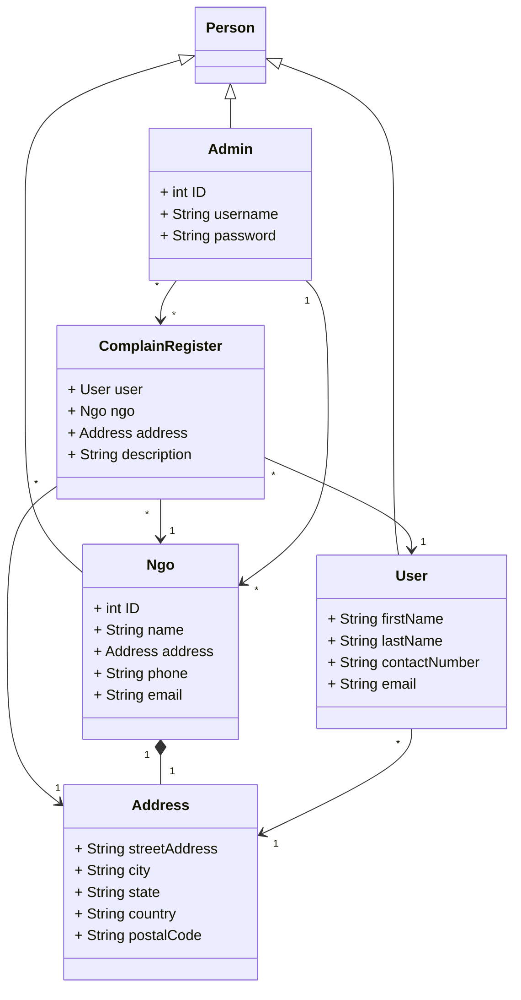

## Project Title: **SafeHarbourYouth**

## Description  

1. **Youth Connect Portal:**
   Welcome to our Youth Connect Portal, a safe and confidential space for young individuals to reach out, seek support, and lodge complaints regarding any form of abuse or violence they may have experienced. Through this platform, youth can connect with our trusted partner NGOs who are dedicated to providing assistance, guidance, and resources to help navigate through challenging situations. Your voice matters, and here, you will find a community ready to listen, support, and advocate for your well-being.

2. **NGO Response Center:**
   Our NGO Response Center serves as a hub for our partner organizations to address and investigate complaints lodged by youth regarding abuse or violence. With a commitment to swift and empathetic action, our NGOs diligently review and respond to each case with care and professionalism. Through collaboration and dedication, we strive to ensure that every individual's concerns are heard, validated, and met with appropriate support and intervention.

3. **Youth Empowerment Hub:**
   Step into our Youth Empowerment Hub, where knowledge becomes power and enlightenment paves the way for resilience. Here, young minds will find a wealth of resources, articles, and educational content aimed at raising awareness about various forms of violence and abuse. From understanding the signs to learning about rights and available support systems, this space is designed to equip youth with the tools and insights they need to stay informed, empowered, and resilient in the face of adversity. Together, let's shine a light on darkness and foster a culture of empathy, understanding, and empowerment.

## Team Member Emails

   Sohni Rais: <rais.s@northeastern.edu>
   Vinay Shivram Sathe: <sathe.v@northeastern.edu>
   Sushma Kunjangada Arun: <kunjangadaarun.s@northeastern.edu>
   Aadit Samir Shah: <shah.aadit1@northeastern.edu>

# Object Model

