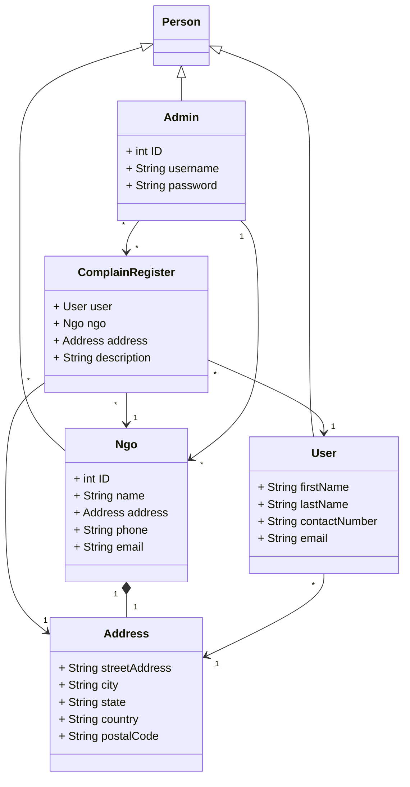

# Object Model

```mermaid
---
Object Model for SafeHarbourYouth
---
classDiagram
    class Person{

    }
    class Admin{
        + int ID
        + String username
        + String password
    }
    class Ngo{
        + int ID
        + String name
        + Address address
        + String phone
        + String email
    }
    class User{
        + String firstName
        + String lastName
        + String contactNumber
        + String email
    }
    class ComplainRegister{
        + User user
        + Ngo ngo
        + Address address
        + String description
    }
    class Address{
        + String streetAddress
        + String city
        + String state
        + String country
        + String postalCode
    }

    Person <|-- Admin
    Person <|-- Ngo
    Person <|-- User

    ComplainRegister "*" --> "1" Ngo
    ComplainRegister "*" --> "1" User
    ComplainRegister "*" --> "1" Address

    Admin "1" --> "*" Ngo
    Admin "*" --> "*" ComplainRegister

    Ngo "1" *-- "1" Address
    User "*" --> "1" Address


```
